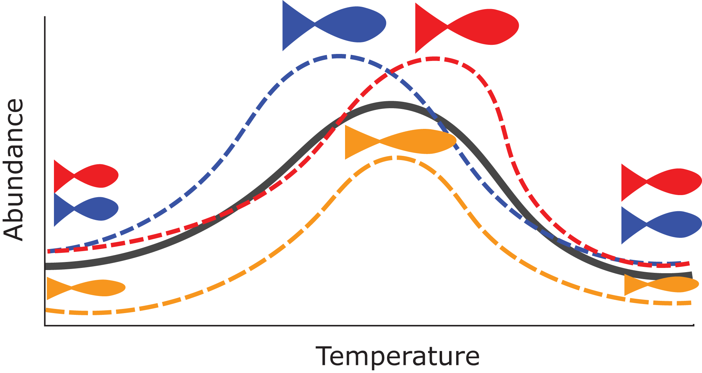
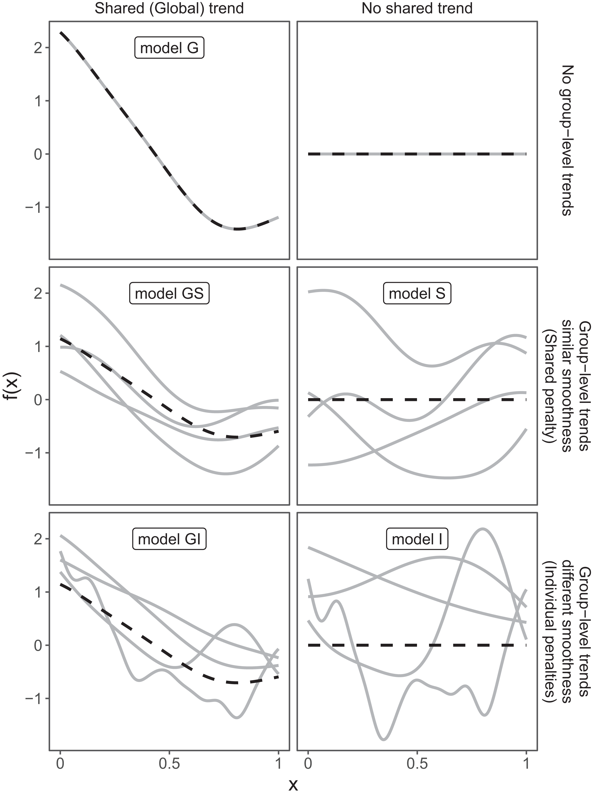

```{r setup, include=FALSE}
knitr::opts_chunk$set(echo = TRUE)
```

### Resources:
 - https://cran.r-project.org/web/packages/gamair/gamair.pdf
 - https://mfasiolo.github.io/mgcViz/reference/gammV.html
 - http://web.mit.edu/~r/current/arch/i386_linux26/lib/R/library/mgcv/html/mgcv-FAQ.html
 - A cool StackExchange example on binomial data: https://stats.stackexchange.com/questions/189384/predicting-mean-smooth-in-gam-with-smooth-by-random-factor-interaction
 - plotting vizzz: https://mfasiolo.github.io/mgcViz/articles/mgcviz.html
 - https://people.maths.bris.ac.uk/~sw15190/mgcv/check-select.pdf
 
### Research articles about GAMM
 - https://peerj.com/articles/6876/
 
 
 
## A few things about GAMM 

~ **When to use?**

We might want to allow for nonlinear predictors while also including random effects to account for
spatiotemporal structure etc.

When estimating GAMMs as a mixed model, we need to compute confidence /credible intervals as for GAM. Beta now contains both i) all the *fixed  effects* and the *random effects* for the smooth terms (only). 

Sometimes a random effects model is required with a large number of smooth curves, which really are the random effects. That is, we might have a random smooth curve per subject, these can  be set up to be efficiently computed in `gamm` anf `gamm4`

After all, the most important should be knowing what do you want to accomplish by using random effects. Then use find the most appropriate model structure.

{width=400px}

&nbsp;
&nbsp;
&nbsp;


## GAMMs in R: 

There are two main libraries that will do GAMs and GAMMs. 

- `mgcv`  includes `gamm` function which fits GAMMs based on linear models as implemented in `nlme` library. 
- `gamm4`  includes `gamm4` function which fits GAMMs based on linear models implemented in `lme4`. 

~ **Pros / Cons:** 

`mgcv`: This gives full access to random effects and correlation structure, just as it is available in `lme`. Work hard with optimization because it is hard separate out a trend from correlation. Hard work for model optimizer. It's easy to make model that runs into numerical problems of estimation. Function performs re-parameterization directly or as a part of PQL iteration.

`gamm4`: Does not give correlation structure, does not rely on PQL for GLMM estimation.

`gamm4` or  `mgcv`? 

~ **What functions?**

`mgcv::gam`, `mgcv::bam`, `mgcv::gamm`, or `gamm4::gamm`
Pedersen EJ, Miller DL, Simpson GL, Ross N. 2019. Hierarchical generalized additive models in ecology: an introduction with mgcv. PeerJ 7:e6876 https://doi.org/10.7717/peerj.6876

&nbsp;
&nbsp;
&nbsp;
&nbsp;

### Wiggliness *vs* Smooths (similar wiggliness is not the same as similar shape)
*(Directly from Pedersen et al., 2019)*

Know your question: 
- It is assumed that the random effects and correlation structures are employed primarily to model residual correlation in the data and that the prime interest is in inference about the terms in the fixed effects model formula including the smooths

1. Should each group have its own smoother, or will a common smoother suffice?

2. Do all of the group-specific smoothers have the same wiggliness, or should each group have its own smoothing parameter?

3. Will the smoothers for each group have a similar shape to one another—a shared global smoother?


Smooths specification: In `mgcv::gam` (and `mgcv::gamm`) it is an argument in each `s()` predictor variable, but the wiggly components of the smooth are treated as random effects

The random effects are included in GAM using `s(..., bs="re")`

~ **When to use mixed model? what determined random effect structure?** 
*(Directly from Pedersen et al., 2019)*

> 1. A single common smoother for all observations; We will refer to this as **model G**, as it only has a Global smoother.
>
>
> `gam(log(uptake) ~ s(log(conc), k=5, bs="tp") + s(Plant_uo, k=12, bs="re")`
>
> 2. A global smoother plus group-level smoothers that have the same wiggliness. We will refer to this as **model GS** (for Global smoother with individual effects that have a Shared penalty).
> 
>`gam(log(uptake) ~ s(log(conc), k=5, m=2) + s(log(conc), Plant_uo, k=5,  bs="fs", m=2)`
>
> 3. A global smoother plus group-level smoothers with differing wiggliness. We will refer to this as **model GI** (for Global smoother with individual effects that have Individual penalties).
>
> `gam(log(uptake) ~ s(log(conc), k=5, m=2, bs="tp") + s(log(conc), by= Plant_uo, k=5, m=1, bs="tp") + s(Plant_uo, bs="re", k=12)`
>
> 4. Group-specific smoothers without a global smoother, but with all smoothers having the same wiggliness. We will refer to this as **model S**.
>
> `gam(log(uptake) ~ s(log(conc), Plant_uo, k=5, bs="fs", m=2)`
>
> 5. Group-specific smoothers with different wiggliness. We will refer to this as **model I**.
>
> `gam(log(uptake) ~ s(log(conc), by=Plant_uo, k=5, bs="tp", m=2) + s(Plant_uo, bs="re", k=12)`
>

{width=200px; height=600px}


Benefits using mixed GAMM in place of GAM >> **hierarchical modelling!**
Mixed modelling functions are typically set to compute and converge efficiently using the sparsity structures of the random effect in ways that *not*-mixed models are not (e.g. `gam`)


&nbsp;
&nbsp;
&nbsp;
&nbsp;


### Real examples

! Code available from Git repo, open source in association with Pedersen et al., 2019:  https://peerj.com/articles/6876/
(We only modified some plots, all the good info and more code on their Git)


```{r, message=FALSE, warning=FALSE}
library(mgcv)
library(gamm4)
library(gamair)
library(MASS)
library(lme4)
library(lattice)
library(knitr)
library(datasets)
library(tidyverse)

```


``` {r , include = FALSE}
#Loading simulated bird movement data
#The default CO2 plant variable is ordered;
data(CO2)
CO2 <- transform(CO2, Plant_uo=factor(Plant, ordered=FALSE))
``` 


``` {r, echo=FALSE }
CO2_vis_plot <- ggplot(CO2, aes(x=conc, 
                                y=uptake, 
                                group=Plant,
                                color=Plant, 
                                lty=Plant)) +
  geom_point() +
  geom_line() +
  scale_color_manual(values = rep(c("red","blue","black"), times =4))+
  scale_linetype_manual(values = rep(1:4, each=3))+
  guides(color="none",linetype="none")+
  labs(x=expression(CO[2] ~ concentration ~ (mL ~ L^{-1})), 
       y=expression(CO[2] ~ uptake ~ (mu*mol ~ m^{-2})))+
  theme_classic()

print(CO2_vis_plot)

```


### The 5 scenarios: 

### 1. Model G: only has a global smoother


```{r}
CO2_modG <- gam(log(uptake) ~ s(log(conc), k=5, bs="tp") +
                  s(Plant_uo, k=12, bs="re"),
                data=CO2, method="REML", family="gaussian")
  


# setup prediction data
CO2_modG_pred <- with(CO2,
                      expand.grid(conc=seq(min(conc), max(conc), length=100),
                                  Plant_uo=levels(Plant_uo)))

# make the prediction, add this and a column of standard errors to the prediction
# data.frame. Predictions are on the log scale.
CO2_modG_pred <- cbind(CO2_modG_pred,
                       predict(CO2_modG,
                               CO2_modG_pred,
                               se.fit=TRUE,
                               type="response"))

# make the plot. Note here the use of the exp() function to back-transform the
# predictions (which are for log-uptake) to the original scale
ggplot(data=CO2, aes(x=conc, y=uptake, group=Plant_uo, color=Plant_uo)) +
        # facet_wrap(~Plant_uo) +
        geom_ribbon(aes(ymin=exp(fit - 2*se.fit), ymax=exp(fit + 2*se.fit), x=conc, fill=Plant_uo, group=Plant_uo),
              data=CO2_modG_pred, 
              alpha=0.1, 
              inherit.aes=FALSE) +
        geom_line(aes(y=exp(fit)), data=CO2_modG_pred) +
        geom_point() +
        labs(x=expression(CO[2] ~ concentration ~ (mL ~ L^{-1})),
        y=expression(CO[2] ~ uptake ~ (mu*mol ~ m^{-2})))+
        theme_classic()
       

```

```{r,echo=FALSE, fig.height=4, fig.width=7}
plot(CO2_modG, page=1)
```


### 2. Model GS: A global smoother plus group-level smoothers that have the same wiggliness

```{r}
CO2_modGS <- gam(log(uptake) ~ s(log(conc), k=5, m=2) + 
                   s(log(conc), Plant_uo, k=5,  bs="fs", m=2),
                  data=CO2, method="REML")

# setup prediction data
CO2_modGS_pred <- with(CO2,
                      expand.grid(conc=seq(min(conc), max(conc), length=100),
                                  Plant_uo=levels(Plant_uo)))

CO2_modGS_pred <- cbind(CO2_modGS_pred,
                       predict(CO2_modGS, 
                               CO2_modGS_pred, 
                               se.fit=TRUE, 
                               type="response"))

ggplot(data=CO2, aes(x=conc, y=uptake, group=Plant_uo, color=Plant_uo)) +
  # facet_wrap(~Plant_uo) +
 geom_ribbon(aes(ymin=exp(fit - 2*se.fit), ymax=exp(fit + 2*se.fit), x=conc, fill=Plant_uo, group=Plant_uo),
              data=CO2_modGS_pred, 
              alpha=0.1, 
              inherit.aes=FALSE) +
  geom_line(aes(y=exp(fit)), data=CO2_modGS_pred) +
  geom_point() +
  labs(x=expression(CO[2] ~ concentration ~ (mL ~ L^{-1})),
       y=expression(CO[2] ~ uptake ~ (mu*mol ~ m^{-2})))+
  theme_classic()


```

```{r, echo=FALSE, fig.height=4, fig.width=7}
plot(CO2_modGS, page=1)
```


### 3. Model GI:A global smoother plus group-level smoothers with differing wiggliness.

```{r}

CO2_modGI <- gam(log(uptake) ~ s(log(conc), k=5, m=2, bs="tp") +
                   s(log(conc), by= Plant_uo, k=5, m=1, bs="tp") +
                   s(Plant_uo, bs="re", k=12),
                 data=CO2, method="REML")

# make the prediction, add this and a column of standard errors to the prediction
# data.frame. Predictions are on the log scale.
# setup prediction data
CO2_modGI_pred <- with(CO2,
                      expand.grid(conc=seq(min(conc), max(conc), length=100),
                                  Plant_uo=levels(Plant_uo)))

CO2_modGI_pred <- cbind(CO2_modGI_pred,
                       predict(CO2_modGI, 
                               CO2_modGI_pred, 
                               se.fit=TRUE, 
                               type="response"))

ggplot(data=CO2, aes(x=conc, y=uptake, group=Plant_uo, color=Plant_uo)) +
  # facet_wrap(~Plant_uo) +
 geom_ribbon(aes(ymin=exp(fit - 2*se.fit), ymax=exp(fit + 2*se.fit), x=conc, fill=Plant_uo, group=Plant_uo),
              data=CO2_modGI_pred, 
              alpha=0.1, 
              inherit.aes=FALSE) +
  geom_line(aes(y=exp(fit)), data=CO2_modGI_pred) +
  geom_point() +
  labs(x=expression(CO[2] ~ concentration ~ (mL ~ L^{-1})),
       y=expression(CO[2] ~ uptake ~ (mu*mol ~ m^{-2})))+
  theme_classic()

```


```{r,echo=FALSE,  fig.height=8, fig.width=8}
plot(CO2_modGI, page=1)
```

### 4. Model S: Group-specific smoothers without a global smoother, but with all smoothers having the same wiggliness. 

```{r}
CO2_modS <- gam(log(uptake) ~ s(log(conc), Plant_uo, k=5, bs="fs", m=2),
                data=CO2, method="REML")

# setup prediction data
CO2_modS_pred <- with(CO2,
                      expand.grid(conc=seq(min(conc), max(conc), length=100),
                                  Plant_uo=levels(Plant_uo)))

CO2_modS_pred <- cbind(CO2_modS_pred,
                       predict(CO2_modS, 
                               CO2_modS_pred, 
                               se.fit=TRUE, 
                               type="response"))

ggplot(data=CO2, aes(x=conc, y=uptake, group=Plant_uo, color=Plant_uo)) +
  # facet_wrap(~Plant_uo) +
 geom_ribbon(aes(ymin=exp(fit - 2*se.fit), ymax=exp(fit + 2*se.fit), x=conc, fill=Plant_uo, group=Plant_uo),
              data=CO2_modS_pred, 
              alpha=0.1, 
              inherit.aes=FALSE) +
  geom_line(aes(y=exp(fit)), data=CO2_modS_pred) +
  geom_point() +
  labs(x=expression(CO[2] ~ concentration ~ (mL ~ L^{-1})),
       y=expression(CO[2] ~ uptake ~ (mu*mol ~ m^{-2})))+
  theme_classic()

```


```{r, echo=FALSE, fig.height=4, fig.width=4}
plot(CO2_modS, pages=1)
```

### 5. Model I: Group-specific smoothers with different wiggliness.


```{r}
CO2_modI <- gam(log(uptake) ~ s(log(conc), by=Plant_uo, k=5, bs="tp", m=2) +
                  s(Plant_uo, bs="re", k=12),
                data=CO2, method="REML")

# setup prediction data
CO2_modI_pred <- with(CO2,
                      expand.grid(conc=seq(min(conc), max(conc), length=100),
                                  Plant_uo=levels(Plant_uo)))

CO2_modI_pred <- cbind(CO2_modI_pred,
                       predict(CO2_modI, 
                               CO2_modI_pred, 
                               se.fit=TRUE, 
                               type="response"))

ggplot(data=CO2, aes(x=conc, y=uptake, group=Plant_uo, color=Plant_uo)) +
  # facet_wrap(~Plant_uo) +
 geom_ribbon(aes(ymin=exp(fit - 2*se.fit), ymax=exp(fit + 2*se.fit), x=conc, fill=Plant_uo, group=Plant_uo),
              data=CO2_modI_pred, 
              alpha=0.1, 
              inherit.aes=FALSE) +
  geom_line(aes(y=exp(fit)), data=CO2_modI_pred) +
  geom_point() +
  labs(x=expression(CO[2] ~ concentration ~ (mL ~ L^{-1})),
       y=expression(CO[2] ~ uptake ~ (mu*mol ~ m^{-2})))+
  theme_classic()
```


```{r, echo=FALSE, fig.height=8, fig.width=8}
plot(CO2_modI, pages=1)
```

#### Compare all fits together

How differently these models perform?

```{r, echo=FALSE, fig.width = 3, fig.width = 8}

CO2_modG_pred$modType<-"G"
CO2_modGS_pred$modType<-"GS"
CO2_modGI_pred$modType<-"GI"
CO2_modS_pred$modType<-"S"
CO2_modI_pred$modType<-"I"

pred<-rbind(CO2_modG_pred, CO2_modGS_pred, CO2_modGI_pred, CO2_modS_pred, CO2_modI_pred)

ggplot(data=pred, aes(x=conc, y=exp(fit), group=modType, color=modType)) +
  facet_wrap(~Plant_uo) +
  geom_line() +
  # geom_point() +
  labs(x=expression(CO[2] ~ concentration ~ (mL ~ L^{-1})),
       y=expression(CO[2] ~ uptake ~ (mu*mol ~ m^{-2})))+
  theme_classic()

```


```{r, include=FALSE}
AIC_table <- AIC(CO2_modG,CO2_modGS, CO2_modGI, CO2_modS, CO2_modI)%>%
  rownames_to_column(var= "Model")%>%
  mutate(data_source = rep(c("CO2"), each =5))%>%
  group_by(data_source)%>%
  mutate(deltaAIC = AIC - min(AIC))%>%
  ungroup()
```

```{r, echo=FALSE}
kable(AIC_table[,1:5])
```


#### Best Model based on AIC is "Model I"

```{r}
summary(CO2_modI)
gam.check(CO2_modGI)
CO2_modI$edf
qq.gam(CO2_modGI)

```

&nbsp;
&nbsp;
&nbsp;
&nbsp;
&nbsp;
&nbsp;
&nbsp;
&nbsp;

#### How would this be in other packages?

#### Interpret the results when using GAMM `gam$lme` vs `gam$gam`

```{r, include=FALSE}
# CO2_modG.gamm <- gamm(log(uptake) ~ s(log(conc), k=5, bs="tp") +
#                   s(Plant_uo, k=12, bs="re"),
#                 data=CO2, family="gaussian")
# 
# plot(CO2_modG.gamm)

```

&nbsp;
&nbsp;
&nbsp;
&nbsp;
&nbsp;
&nbsp;
&nbsp;
&nbsp;
&nbsp;


### 1.  Temperature in Cairo 

About the data: Daily temperature data fro Cairo, specifically the average air temperature (F) in Cairo from Jan 1st 1995. The dataset can be found in package "gamair". (https://cran.r-project.org/web/packages/gamair/gamair.pdf)

``` {r, echo=FALSE}
data(cairo)
with(cairo,plot(time,temp,type="l"))
``` 

``` {r}
kable(cairo[1:5,], caption = "Cairo data")
str(cairo)
``` 


####  Fitting GAMMs using Wood's 'mgcv' approach 

Random effects: 
Fixed effects:

- mgcv::gam.check can be used to determine if K has been set too low


``` {r }

## 7.7.2 Cairo temperature
ctamm <- gamm(temp ~ s(day.of.year, bs="cc",k=20) + s(time, bs="cr"), data=cairo, correlation = corAR1(form=~1|year))
ctamm.gam <- gam(temp ~ s(day.of.year, bs="cc",k=20) + s(time, bs="cr") , data=cairo)
ctamm25 <- gamm(temp ~ s(day.of.year) + s(time), data=cairo, correlation = corAR1(form=~1|year))

plot(ctamm$gam,scale=0,pages=1)
plot(ctamm.gam,scale=0,pages=1) 
plot(ctamm25$gam,pages=1)

``` 

``` {r, echo=FALSE, include=FALSE}

gam.check(ctamm$gam)
intervals(ctamm$lme,which="var-cov")
ctamm$gam$sig2/ctamm$gam$sp

summary(ctamm$gam)
summary(ctamm$lme)
summary(ctamm$gam)

anova(ctamm$gam)

```

####  'gamm4' approach 

``` {r, warning=FALSE}
data(cairo)
ctamm.gamm4 <- gamm4(temp ~ s(day.of.year) + s(time) , data=cairo, random=~(1|year))

plot(ctamm.gamm4$gam,pages=1)

```


&nbsp;
&nbsp;
&nbsp;
________________________
### 2. Sitka AKA Random wiggly data

About the data: Sitka tree growth data under enhanced ozone and control conditions, 'random wiggly data'?! sounds like ecology 


``` {r, echo=FALSE, include=FALSE}
data(sitka)
with(cairo,plot(time,temp,type="l"))
``` 

``` {r, include=FALSE}
kable(sitka[1:5,], caption = "Sitka")
str(sitka)
``` 

``` {r }
xyplot(log.size~days|as.factor(ozone),data=sitka,type="l",groups=id.num)

```


#### 2.1. Fitting GAMMs using Wood's 'mgcv' approach 


``` {r}
sitka$id.num <- as.factor(sitka$id.num) # random factor needs to be a factor
b <- gamm(log.size~s(days) + ozone + ozone:days + s(days,id.num,bs="fs",k=5),data=sitka)
plot(b$gam,pages=1)


b.gam <- gam(log.size~s(days) + ozone + ozone:days + s(days,id.num,bs="fs",k=5), data=sitka)
plot(b.gam,pages=1)

```


